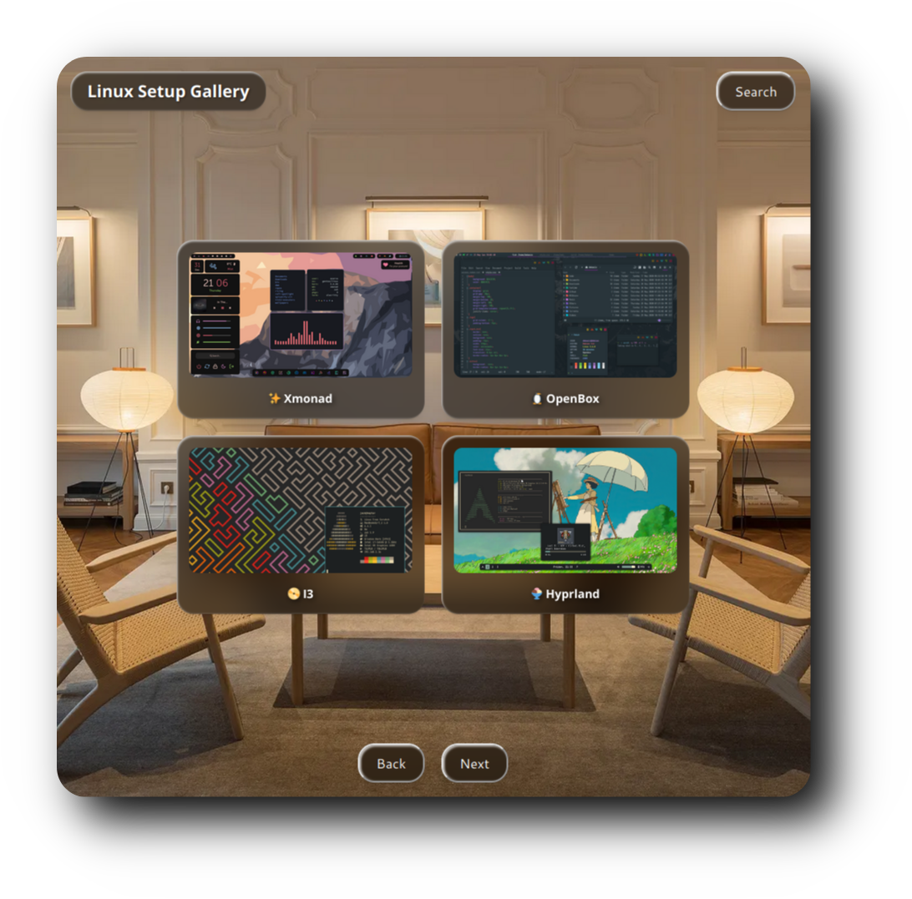

<div align="center">
  <h1>☄️ <strong>𝗟𝗶𝗻𝘂𝘅 𝘀𝗲𝘁𝘂𝗽 𝗴𝗮𝗹𝗹𝗲𝗿𝘆</strong> ☄️</h1>
</div>


<div align="center">
  <h2 style="font-size: 24px;">
    <strong> <a href="https://user7210unix.github.io/topunixsite/" style="text-decoration: none; color: inherit;">
      
      Link to the Website</a> 
    </strong>
  </h2>
</div>

<div align="center">

```css
  _      _                                _                               _ _                 
 | |    (_)                              | |                             | | |                
 | |     _ _ __  _   ___  __     ___  ___| |_ _   _ _ __       __ _  __ _| | | ___ _ __ _   _ 
 | |    | | '_ \| | | \ \/ /    / __|/ _ \ __| | | | '_ \     / _` |/ _` | | |/ _ \ '__| | | |
 | |____| | | | | |_| |>  <     \__ \  __/ |_| |_| | |_) |   | (_| | (_| | | |  __/ |  | |_| |
 |______|_|_| |_|\__,_/_/\_\    |___/\___|\__|\__,_| .__/     \__, |\__,_|_|_|\___|_|   \__, |
                                                   | |         __/ |                     __/ |
                                                   |_|        |___/                     |___/ 
```


<h1>
      
</div>
</div> 


## ⚙️ Features
- **Minimal** :bento: 
- **Fast** :blossom: 
- **Search for Window Managers** :rocket:
- **Regulare Updates** :rocket:
- **Written in Html** :blossom:
- **Written in Css** :rocket: 
- **Written in JavaScript** :bento:  

### :octocat: ‎ <sup><sub><samp>HI THERE! THANKS FOR DROPPING BY!</samp></sub></sup>
